

  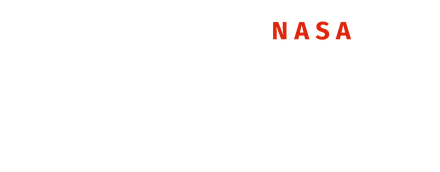

<h1 align="center">NASA Space Apps Challenge</h1>

A collection of my participation records in the <strong>NASA Space Apps Challenge</strong> competitions across 2023, 2024, and 2025. This repository documents the challenges tackled, teams assembled, solutions developed, and experiences gained from this prestigious global hackathon organized by NASA.

 

## 🚀 About NASA Space Apps Challenge

The **NASA Space Apps Challenge** is an annual two-day hackathon where teams from around the globe work to solve real-world problems facing our planet and space exploration. Hosted by NASA in partnership with the State Department, it brings together innovators, technologists, entrepreneurs, and space enthusiasts to create solutions using NASA's open data and technology.

Participants work on challenges spanning topics like:
- Earth science and climate change
- Planetary exploration
- Habitable exoplanets
- Space technology and innovation
- And many more!

The competition is divided into two tracks: **Global** and **Local**, with winning teams earning recognition at NASA centers and beyond.

 

---

 

## 🎯 2023 Edition

<strong>📍 Aracaju, SE - Brazil</strong>

### Challenge
**[Habitable Exoplanets: Creating Worlds Beyond Our Own](https://www.spaceappschallenge.org/2023/challenges/habitable-exoplanets-creating-worlds-beyond-our-own/)**

> Are we alone in the universe? To address this question, NASA's next flagship space telescope, the Habitable Worlds Observatory (HWO), will search for habitable planets beyond our solar system. What do you think these worlds will look like? Your challenge is to use publicly available information on habitable worlds to design your own habitable world and write about what life might be like on it.

### Our Solution

The main goal of our challenge is to establish an exoplanetary environment conducive to human habitation. Leveraging data resources made available by NASA, our team has developed a website that empowers users to construct a viable exoplanet by inputting essential parameters. Comprising predominantly of developers and one designer, our team has augmented this platform with an artificial intelligence (AI) component, which serves to visualize the outcomes derived from user-generated content.

### Team: MoonMonkeys

<table border="0">
  <tr>
    <td width="35%" align="center">
      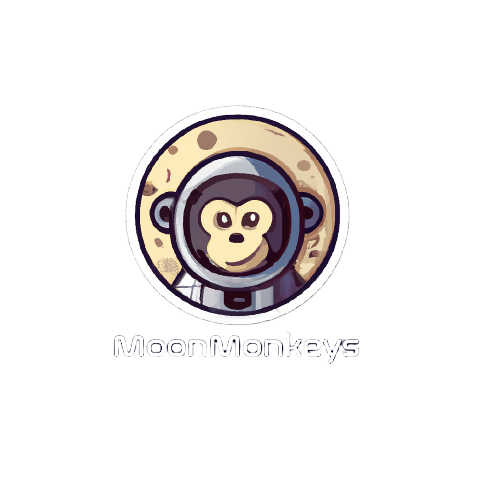
    </td>
    <td width="65%" valign="middle" style="padding-left: 30px;">
      <h3>🐒 We were born on the moon and we're trying to conquer the earth</h3>
    </td>
  </tr>
</table>

We appreciate the following people who contributed to this solution:

<table>
  <tr>
    <td align="center">
      <a href="https://github.com/MaykeESA">
         
      </a>
      
        <b>Mayke Erick</b> 
      
    </td>
    <td align="center">
      <a href="https://github.com/Dyel-L">
         
      </a>
      
        <b>Dylan Bitencourt</b> 
      
    </td>
    <td align="center">
      <a href="https://github.com/George-b1t">
         
      </a>
      
        <b>George Soares</b> 
      
    </td>
    <td align="center">
      <a href="https://github.com/YuriGarciaRibeiro">
         
      </a>
      
        <b>Yuri Garcia</b> 
      
    </td>
    <td align="center">
      <a href="https://github.com/GugaAAndrade">
         
      </a>
      
        <b>Gustavo Alves</b> 
      
    </td>
    <td align="center">
      <a href="https://github.com/gabrielnalmeida">
         
      </a>
      
        <b>Gabriel Nunes</b> 
      
    </td>
  </tr>
</table>

### Event Photos

<table>
  <tr>
    <td align="center">
      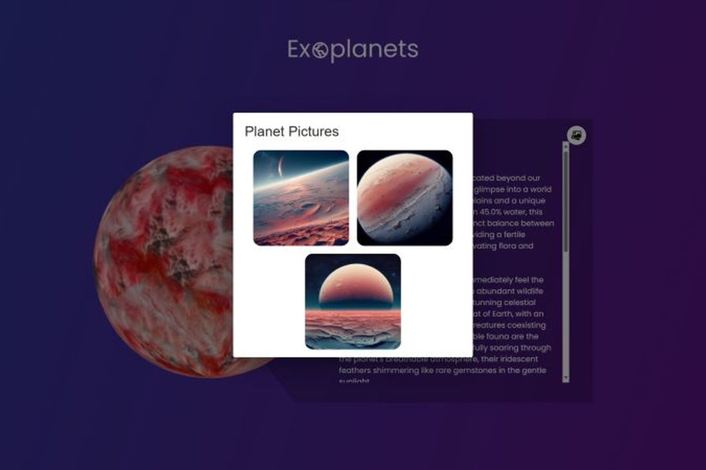
       Event Moment
    </td>
    <td align="center">
      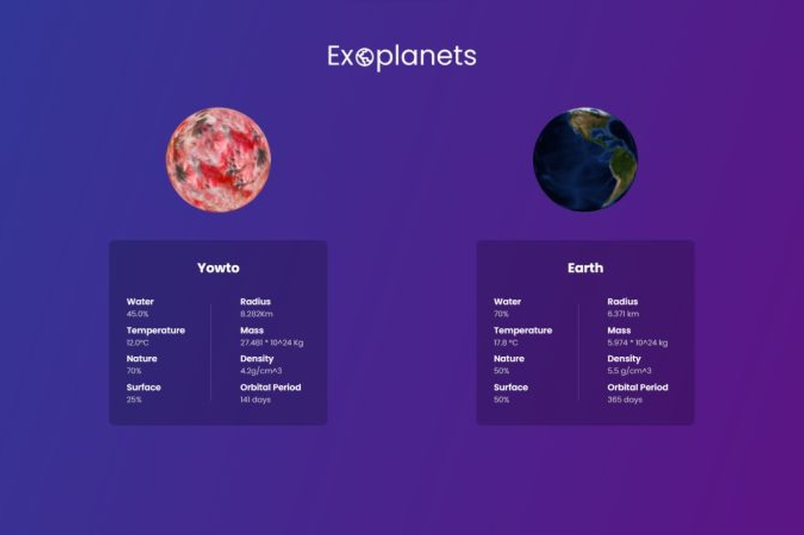
       Team Moment
    </td>
  </tr>
  <tr>
    <td align="center">
      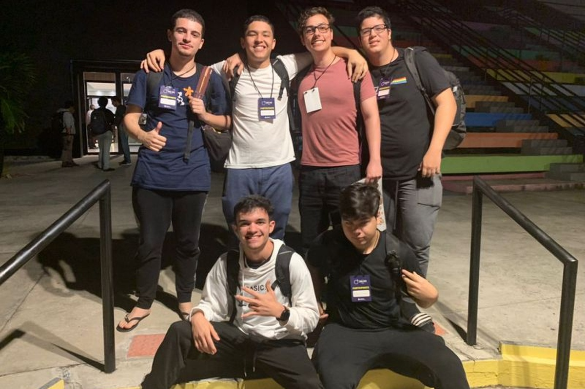
       Challenge Day
    </td>
    <td align="center">
      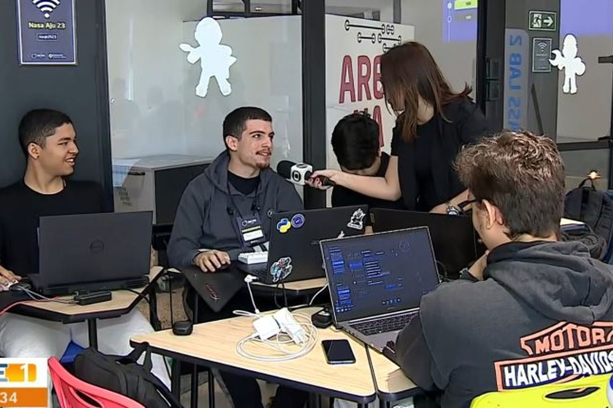
       Event Conclusion
    </td>
  </tr>
</table>

### Solution
- **NASA Space Apps Challenge**: [MoonMonkeys Project](https://www.spaceappschallenge.org/2023/find-a-team/moonmonkeys/?tab=project)

### Results
🏆 **Global Nominees** - Our solution was nominated at the global level

### Shared Content
**Posts:**
- [Team Participation and Photos by Mayke Erick](https://www.linkedin.com/posts/maykeesa_nossa-participa%C3%A7%C3%A3o-no-hackathon-da-nasa-space-activity-7117125501130805249-Xg5H?utm_source=share&utm_medium=member_desktop)
- [Challenge, Solution and Prototype Images by Gustavo Alves](https://www.linkedin.com/posts/guga-andrade_desafio-exoplanetas-habit%C3%A1veis-criando-ugcPost-7117242266355666944-AdWf?utm_source=share&utm_medium=member_desktop)
- [Event and Team Photos by Fabio Santos](https://www.linkedin.com/posts/activity-7116856048728064000-cfqa?utm_source=share&utm_medium=member_desktop)
- [Local Winners Announcement](https://www.linkedin.com/posts/maykeesa_ganhamoooss-agora-vamos-para-pr%C3%B3xima-activity-7120015651145998337-NRSf?utm_source=share&utm_medium=member_desktop)
- [Global Nominees Announcement](https://www.linkedin.com/posts/maykeesa_vammooooosss-n%C3%B3s-da-equipe-moonmonkeys-activity-7125282617976926208-oAty?utm_source=share&utm_medium=member_desktop)
- [Event Experience by Gabriel Nunes](https://www.linkedin.com/posts/gabriel-almeida-157847222_no-%C3%BAltimo-fim-de-semana-tive-o-privil%C3%A9gio-ugcPost-7117137125355008000-ezWH)
- [Challenge and Solution by Yuri Garcia](https://www.linkedin.com/posts/yurigarciaribeiro_nasaspaceapps-inovaaexaeto-exoplanetas-activity-7117114422673760256-Z6Io)
- [Local Winners Announcement by Yuri Garcia](https://www.linkedin.com/posts/yurigarciaribeiro_estou-muito-feliz-e-grato-em-compartilhar-activity-7120011783586656257-zzmN)
- [Event Experience by Dylan Bitencourt](https://www.linkedin.com/posts/dylan-bitencourt-gon%C3%A7alves_no-%C3%BAltimo-final-de-semana-tive-o-privil%C3%A9gio-activity-7117483021930311681-ZzxN)
- [Global Nominees Announcement by George Soares](https://www.linkedin.com/posts/george-soares-cj_nasa-spaceapps-exoplanetas-activity-7121121884284342272-Xk17)

 

---

 

## 🎯 2024 Edition

<strong>📍 Aracaju, SE - Brazil</strong>

### Challenge
**[Leveraging Earth Observation Data for Informed Agricultural Decision-Making](https://www.spaceappschallenge.org/nasa-space-apps-2024/challenges/leveraging-earth-observation-data-for-informed-agricultural-decision-making/)**

> Farmers face a deluge of water-related challenges due to unpredictable weather, pests, and diseases. These factors can significantly impact crop health, farmers' profits, and food security. Depending upon the geography, many farmers may face droughts or floods—sometimes both of these extreme events occur within the same season! Your challenge is to design a tool that empowers farmers to easily explore, analyze, and utilize NASA datasets to address these water-related concerns and improve their farming practices.

### Our Solution

At AgriTech, we develop technological solutions for farmers of all sizes to monitor their crops efficiently and intelligently. Our platform combines advanced hardware that collects real-time environmental data (such as temperature, humidity and soil quality) with intuitive software that turns this information into actionable insights to improve productivity. In addition to personalized dashboards and actionable alerts that help farmers understand what is happening in the field, our devices store and analyze this data over time. The information collected is compared with data from external APIs, creating a moving average that shows how weather and soil conditions directly affect production. For large companies and governments, we offer a powerful environmental intelligence platform. All the data generated by the devices installed on the plantations is centralized and structured, creating a huge database of information on the environmental conditions of the monitored regions. This valuable database can be sold or shared with governments for monitoring and managing green regions, and with large farmers and agribusiness companies looking for precise data on where and what to plant, optimizing the use of land and resources.

### Team: MoonMonkeys

<table border="0">
  <tr>
    <td width="35%" align="center">
      
    </td>
    <td width="65%" valign="middle" style="padding-left: 30px;">
      <h3>We're monkeys thirsting to conquer space! 🐒</h3>
    </td>
  </tr>
</table>

We appreciate the following people who contributed to this solution:

<table>
  <tr>
    <td align="center">
      <a href="https://github.com/MaykeESA">
         
      </a>
      
        <b>Mayke Erick</b>
      
    </td>
    <td align="center">
      <a href="https://github.com/YuriGarciaRibeiro">
         
      </a>
      
        <b>Yuri Garcia</b>
      
    </td>
    <td align="center">
      <a href="https://github.com/GugaAAndrade">
         
      </a>
      
        <b>Gustavo Alves</b>
      
    </td>
    <td align="center">
      <a href="https://github.com/paulorugani">
         
      </a>
      
        <b>Paulo Rugani</b>
      
    </td>
    <td align="center">
      <a href="https://www.linkedin.com/in/handelsg/">
        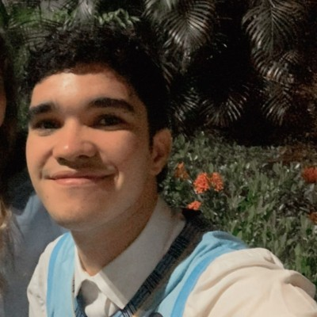 
      </a>
      
        <b>Handel Gomes</b>
      
    </td>
    <td align="center">
      <a href="https://github.com/gabrielnalmeida">
         
      </a>
      
        <b>Gabriel Nunes</b>
      
    </td>
  </tr>
</table>

### Event Photos

<table>
  <tr>
    <td align="center">
      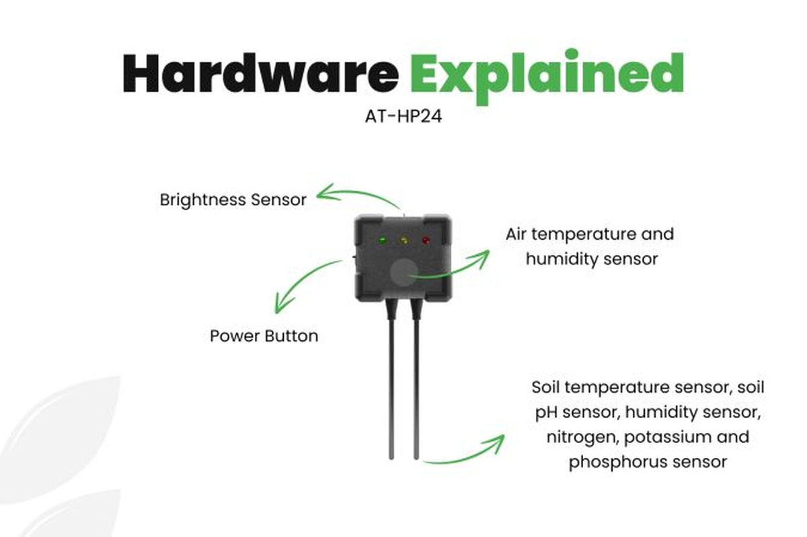
       Event Moment
    </td>
    <td align="center">
      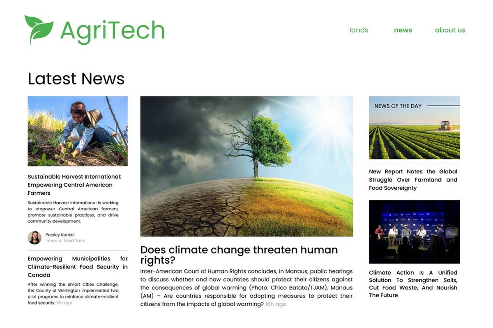
       Team Moment
    </td>
  </tr>
  <tr>
    <td align="center">
      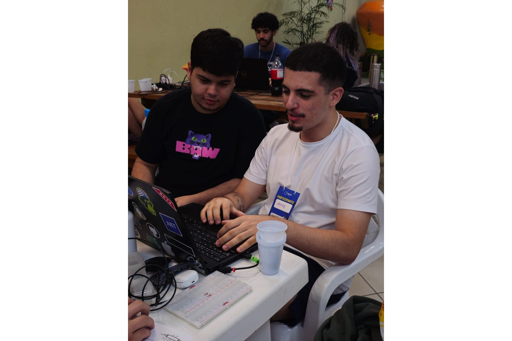
       Challenge Day
    </td>
    <td align="center">
      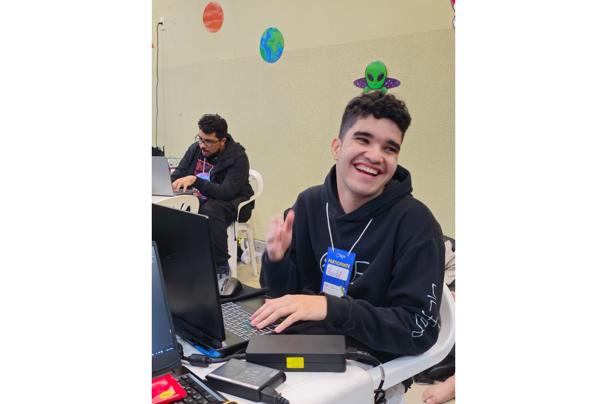
       Event Conclusion
    </td>
  </tr>
</table>

### Solution
- **NASA Space Apps Challenge**: [MoonMonkeys Project](https://www.spaceappschallenge.org/nasa-space-apps-2024/find-a-team/moonmonkeys1/?tab=project)

### Results
🏆 **Global Nominees** - Our solution was nominated at the global level

### Shared Content
**Posts:**
- [Challenge and Solution by Gustavo Alves](https://www.linkedin.com/posts/guga-andrade_nasa-space-apps-challenge-2024-ugcPost-7249786864595812353-OKkJ)
- [Team Participation by Mayke Erick](https://www.linkedin.com/posts/maykeesa_moonmonkeys-mais-uma-vez-em-activity-7252512482575966208-_3wZ)
- [First Hackathon Experience by Paulo Rugani](https://www.linkedin.com/posts/paulo-rugani-645578282_participei-do-meu-primeiro-hackathon-o-activity-7289699457028255744-iCxf)
- [Event Experience by Paulo Rugani](https://www.linkedin.com/posts/paulo-rugani-645578282_nasaspaceapps-activity-7249604882691751936-0YUI)

 

---

 

## 🎯 2025 Edition

<strong>📍 Aracaju, SE - Brazil</strong>

### Challenge
**[A World Away: Hunting for Exoplanets with AI](https://www.spaceappschallenge.org/2025/challenges/a-world-away-hunting-for-exoplanets-with-ai/)**

> Data from several different space-based exoplanet surveying missions have enabled discovery of thousands of new planets outside our solar system, but most of these exoplanets were identified manually. With advances in artificial intelligence and machine learning (AI/ML), it is possible to automatically analyze large sets of data collected by these missions to identify exoplanets. Your challenge is to create an AI/ML model that is trained on one or more of the open-source exoplanet datasets offered by NASA and that can analyze new data to accurately identify exoplanets.

### Our Solution

Exoplorer is an interactive platform that brings people and scientists closer to the fascinating universe of exoplanets. Our goal is to make the exploration of worlds beyond the solar system accessible, engaging, and intelligent. The system combines real astronomical data, collected from NASA telescopes and space databases, with artificial intelligence algorithms capable of organizing, interpreting, and revealing patterns that aid both scientific research and learning. The platform offers two integrated forms of exploration: a technical approach, aimed at researchers and advanced students who wish to analyze detailed information; and an educational approach, designed for the general public, which presents these worlds in a visual and simplified way, with curiosities and simulations that spark interest in the cosmos. In this way, Exoplorer transforms complex data into accessible knowledge, stimulating scientific curiosity and bringing society closer to space discoveries.

### Team: MoonMonkeys

<table border="0">
  <tr>
    <td width="35%" align="center">
      
    </td>
    <td width="65%" valign="middle" style="padding-left: 30px;">
      <h3>We're monkeys thirsting to conquer space! 🐒</h3>
    </td>
  </tr>
</table>

We appreciate the following people who contributed to this solution:

<table>
  <tr>
    <td align="center">
      <a href="https://github.com/MaykeESA">
         
      </a>
      
        <b>Mayke Erick</b>
      
    </td>
    <td align="center">
      <a href="https://github.com/George-b1t">
         
      </a>
      
        <b>George Soares</b>
      
    </td>
    <td align="center">
      <a href="https://github.com/GugaAAndrade">
         
      </a>
      
        <b>Gustavo Alves</b>
      
    </td>
    <td align="center">
      <a href="https://github.com/paulorugani">
         
      </a>
      
        <b>Paulo Rugani</b>
      
    </td>
    <td align="center">
      <a href="https://github.com/YuriGarciaRibeiro">
         
      </a>
      
        <b>Yuri Garcia</b>
      
    </td>
    <td align="center">
      <a href="https://github.com/gabrielnalmeida">
         
      </a>
      
        <b>Gabriel Nunes</b>
      
    </td>
  </tr>
</table>

### Event Photos

<table>
  <tr>
    <td align="center">
      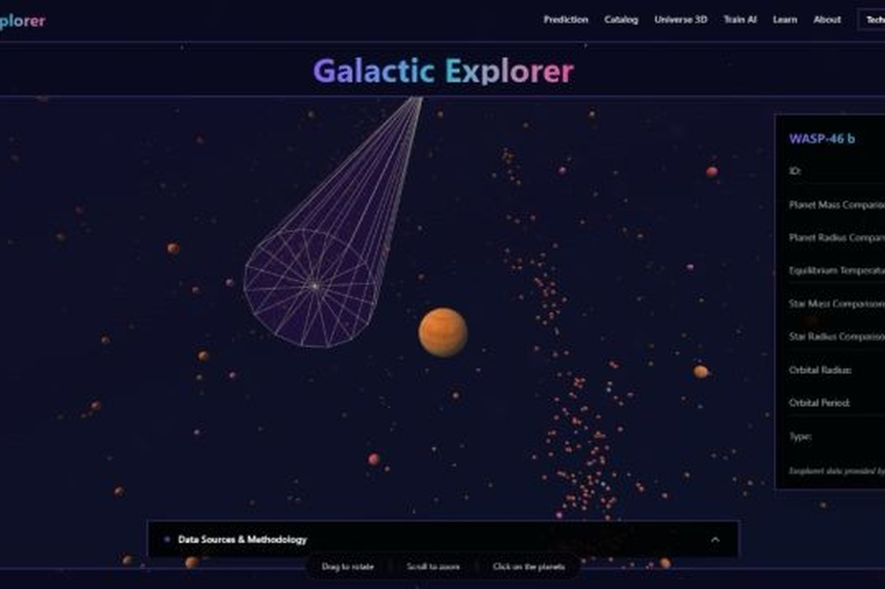
       Team Moment
    </td>
    <td align="center">
      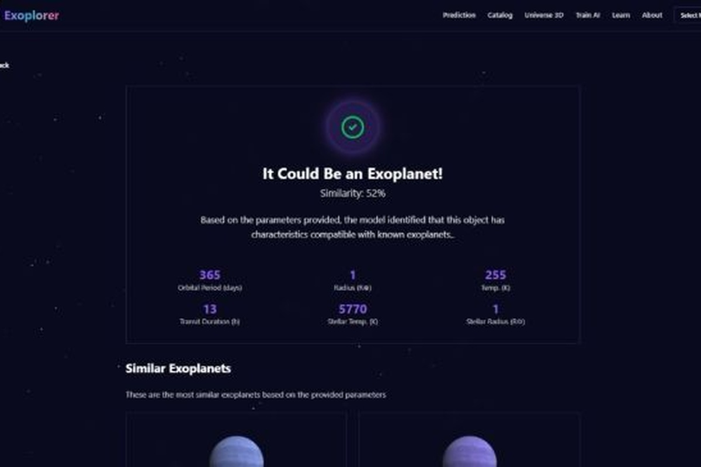
       Event Conclusion
    </td>
  </tr>
  <tr>
    <td align="center">
      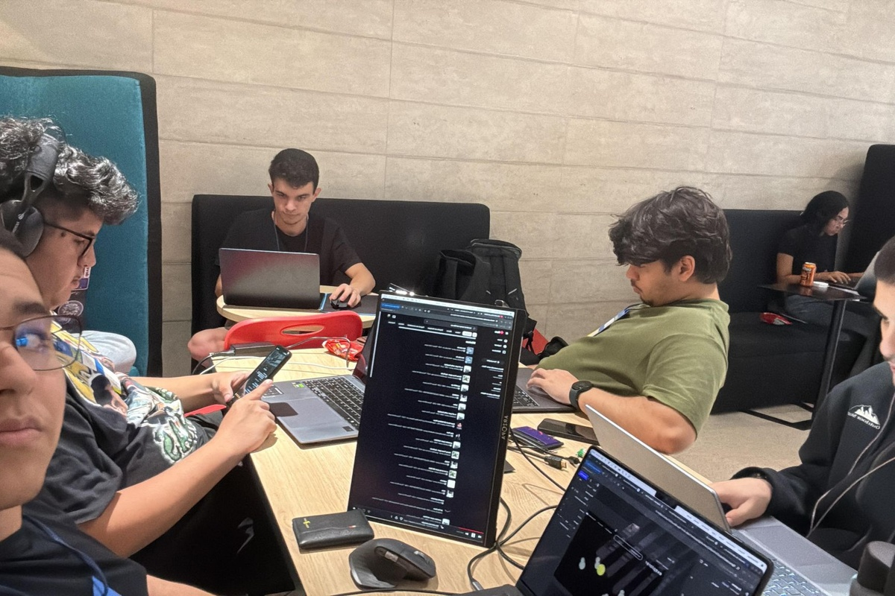
       Event Moment
    </td>
    <td align="center">
      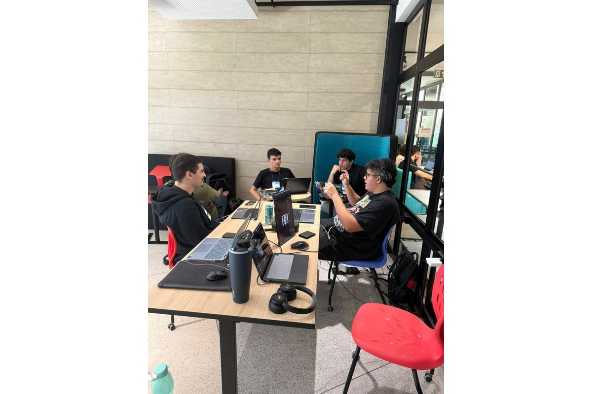
       Challenge Day
    </td>
  </tr>
</table>

### Solution
- **NASA Space Apps Challenge**: [MoonMonkeys Project](https://www.spaceappschallenge.org/2025/find-a-team/moonmonkeys2/?tab=project)

### Results
Participation without any award this year, but a great experience nonetheless.

### Shared Content
**Posts:**
- [Event Experience by Paulo Rugani](https://www.linkedin.com/posts/paulo-rugani-645578282_pt-no-%C3%BAltimo-final-de-semana-participei-activity-7381770654288691201-YFcc)
- [Team Participation by Mayke Erick](https://www.linkedin.com/posts/maykeesa_mais-um-ano-participando-do-nasa-space-apps-activity-7381779073078837248-uxsR)

 

---

 

## 📊 Summary

| Year | Challenge | Team | Results |
|------|-----------|------|---------|
| 2023 | Habitable Exoplanets: Creating Worlds Beyond Our Own | MoonMonkeys | Global Nominees 🏆 |
| 2024 | Leveraging Earth Observation Data for Informed Agricultural Decision-Making | MoonMonkeys | Global Nominee 🏆 |
| 2025 | A World Away: Hunting for Exoplanets with AI | MoonMonkeys | Participant |

 

## 🙏 Acknowledgments

Special thanks to:
- **NASA** and the **Space Apps Challenge** organization for providing this incredible platform
- All team members who contributed their creativity, skills, and dedication
- The local communities and event organizers who made these experiences possible

 

## 📝 Copyright and License

Documentation and media copyright 2026 [Mayke Erick](https://github.com/MaykeESA). 

Content is provided for personal documentation and reference purposes.

---

  <strong>🌍 Exploring Space. Solving Problems. Making a Difference. 🚀</strong>

